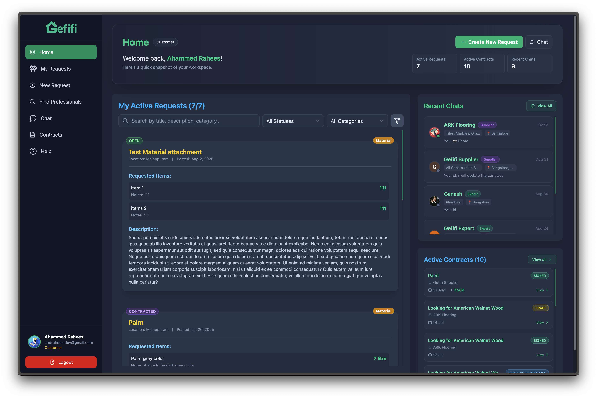
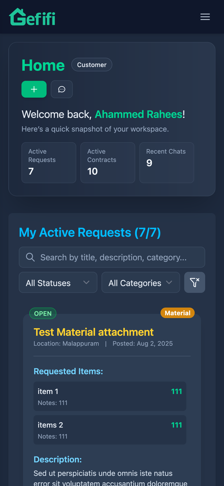

<<<<<<< Updated upstream
# GEFIFI - Construction Marketplace & Management Platform

[](https://svelte.dev)
[](https://firebase.google.com)
[](https://tailwindcss.com)

**GEFIFI** is a cutting-edge Marketplace and Project Management platform ecosystem designed to modernize and streamline the construction industry in India. It bridges the gap between Customers, Construction Experts, and Material Suppliers through a unified, transparent, and AI-enhanced digital experience.

## 🚀 Vision

To empower the Indian construction sector by fostering trust, transparency, and efficiency. GEFIFI simplifies complex project workflows—from finding the right professional to securing quality materials and managing digital contracts.

## ✨ Key Features

- **Multi-Stakeholder Marketplace**: Tailored interfaces for Customers (Visionaries), Experts (Builders), and Suppliers (Resource Providers).
- **Construction Management**: End-to-end tracking of work requests and material procurement.
- **AI-Powered Builder Assist**: Deeply integrated agentic AI to help users navigate project complexities, manage documents (DWG, PDF, etc.), and facilitate communication.
- **Digital Contracts & Agreements**: Securely link and manage agreements between parties directly within the platform.
- **Real-time Collaboration**: Advanced chat system with file sharing, presence tracking, and typing indicators.
- **Premium UI/UX**: A high-performance, responsive interface featuring modern glassmorphism aesthetics and smooth micro-animations.

## 🛠️ Technical Stack

### Frontend

- **Framework**: Svelte 5 & SvelteKit (Runes, Snippets)
- **Styling**: Tailwind CSS 4.0 (Modern Glassmorphism)
- **State Management**: Svelte's reactive `$state` and `$derived` runes.
- **Utilities**: Wavesurfer.js (Audio/Visual data), Marked (Markdown rendering), Lucide Svelte (Icons).

### Backend & Infrastructure

- **Runtime**: Bun / Node.js with TypeScript
- **Backend as a Service**: Firebase (Auth, Firestore, Functions, Storage, Hosting)
- **Deployment**: Google Cloud Platform (GCP) with Cloud Build.
- **Containerization**: Docker for consistent environments across development and production.

### AI Engine

- **Framework**: Developed using the **ADK (Agent Development Kit)** in Python for robust agent orchestration.
- **Agents**: Custom agentic workflows integrated with Google's Gemini models.
- **Capabilities**: Document parsing (DWG/DXF/PDF), automated session management, and project coordination assistance.

## 🛠️ Getting Started

### Prerequisites

- [Bun](https://bun.sh/) or [Node.js](https://nodejs.org/)
- [Firebase CLI](https://firebase.google.com/docs/cli)

### Installation

1. Clone the repository:
   ```bash
   git clone https://github.com/your-username/gefifi-2.git
   cd gefifi-2
   ```
2. Install dependencies:
   ```bash
   bun install
   ```

### Running Locally

To run the full stack locally for development, open four separate terminal tabs and run the following commands in order:

1.  **Tab 1 (Firebase Emulators):**
    ```bash
    ./scripts/firebase-emulator-start.sh
    ```
2.  **Tab 2 (Backend Services):**
    ```bash
    ./scripts/run-backend.sh
    ```
3.  **Tab 3 (AI Agents):**
    ```bash
    ./scripts/run-agents.sh
    ```
4.  **Tab 4 (Frontend App):**
    ```bash
    bun run dev
    ```

## 🔒 Security

The project implements rigorous security measures through **Firestore Security Rules**, ensuring:

- Data privacy for personal profiles and contracts.
- Participant-based access control for chats and project management nodes.
- Role-based permissions for Customers, Experts, and Suppliers.

## 📝 License

This project is private and proprietary. All rights reserved.
=======
<div align="center">
  
  <h1>GEFIFI</h1>
  <p><b>Revolutionizing Construction Management & Marketplaces in India</b></p>

[](https://svelte.dev)
[](https://firebase.google.com)
[](https://tailwindcss.com)
[](LICENSE)

</div>

---

**GEFIFI** is a cutting-edge Marketplace and Project Management platform ecosystem designed to modernize and streamline the construction industry in India. It bridges the gap between Customers, Construction Experts, and Material Suppliers through a unified, transparent, and AI-enhanced digital experience.

---

## 🚀 Vision

To empower the Indian construction sector by fostering trust, transparency, and efficiency. GEFIFI simplifies complex project workflows—from finding the right professional to securing quality materials and managing digital contracts.

## ✨ Key Features

- 🏗️ **Multi-Stakeholder Marketplace**: Tailored interfaces for Customers (Visionaries), Experts (Builders), and Suppliers (Resource Providers).
- 📈 **Construction Management**: End-to-end tracking of work requests and material procurement.
- 🤖 **AI-Powered Builder Assist**: Deeply integrated agentic AI to help users navigate project complexities, manage documents (DWG, PDF, etc.), and facilitate communication.
- 📜 **Digital Contracts & Agreements**: Securely link and manage agreements between parties directly within the platform.
- 💬 **Real-time Collaboration**: Rich, WhatsApp-like chat experience featuring voice messaging, instant file/document sharing, presence tracking, and typing indicators.
- 💎 **Premium UI/UX**: A high-performance, responsive interface featuring modern glassmorphism aesthetics and smooth micro-animations.

---

## 📸 Product Gallery

<div align="center">

|                    **Landing Experience**                     |                     **Professional Dashboard**                     |
| :-----------------------------------------------------------: | :----------------------------------------------------------------: |
|  |  |
|              _Modern entry point for all users_               |              _Comprehensive project at-a-glance view_              |

<br />

|                        **Mobile Accessibility**                         |
| :---------------------------------------------------------------------: |
|  |
|         _Manage requests on the go with a responsive interface_         |

</div>

---

## 🛠️ Technical Stack

<details>
<summary><b>Frontend Excellence</b></summary>
<br />

- **Framework**: Svelte 5 & SvelteKit (utilizing Runes for optimal performance)
- **Styling**: Tailwind CSS 4.0 (Custom Glassmorphism Design System)
- **State Management**: Reactive `$state` and `$derived` runes.
- **Rich Media**: Wavesurfer.js for advanced data visualization.
</details>

<details>
<summary><b>Backend & Infrastructure</b></summary>
<br />

- **Runtime**: Bun / Node.js with TypeScript
- **Services**: Firebase (Auth, Firestore, Cloud Functions, Storage, Hosting)
- **Deployment**: Google Cloud Platform (GCP) with automated Cloud Build pipelines.
- **Standardization**: Docker containerization for reliable deployments.
</details>

<details>
<summary><b>AI Intelligence (ADK)</b></summary>
<br />

- **Framework**: Developed using the **ADK (Agent Development Kit)** in Python.
- **Agents**: Custom agentic workflows powered by Google's Gemini models.
- **Capabilities**: Precision document parsing (DWG/DXF/PDF) and intelligent context-aware assistance.
</details>

---

## ⚡ Quick Start

### 1. Prerequisites

- [Bun](https://bun.sh/) or [Node.js](https://nodejs.org/)
- [Firebase CLI](https://firebase.google.com/docs/cli)

### 2. Setup

```bash
git clone https://github.com/your-username/gefifi-2.git
cd gefifi-2
bun install
```

### 3. Local Development

For a full-system local environment, launch these in separate terminals:

1.  🔥 **Emulators**: `./scripts/firebase-emulator-start.sh`
2.  ⚙️ **Backend**: `./scripts/run-backend.sh`
3.  🤖 **Agents**: `./scripts/run-agents.sh`
4.  🌐 **Frontend**: `bun run dev`

---

## 🔒 Security & Governance

GEFIFI prioritizes security through granular **Firestore Security Rules**, ensuring:

- **Private Data Encryption**: Only authorized parties can access contracts and sensitive project data.
- **Role-Based Access**: Specialized permissions for Customers, Experts, and Suppliers.
- **Secure Communication**: Participant-only access to chat channels.

---

<div align="center">
  <p>© 2026 GEFIFI. Built with ❤️ for the future of construction.</p>
</div>
>>>>>>> Stashed changes
