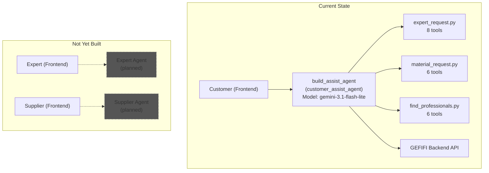
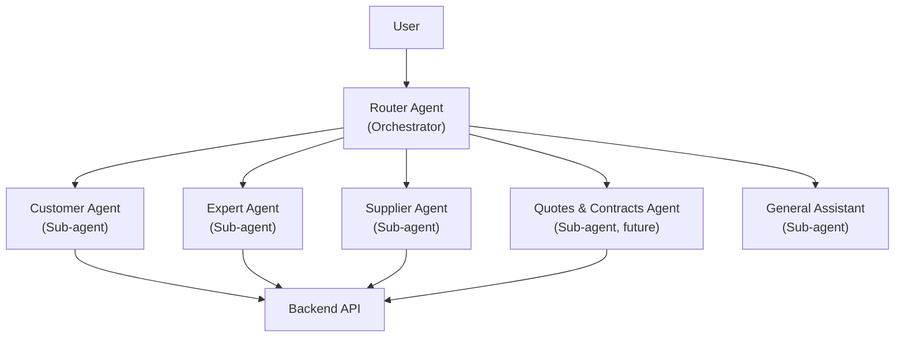

# GEFIFI AI Agent: Capabilities Tracker & Roadmap

This document tracks all user actions in the GEFIFI platform and their current AI agent automation status. It covers the existing `build_assist_agent` (customer-facing), planned Expert and Supplier agents, identifies gaps, and provides architectural recommendations.

---

## Table of Contents
1. [Current Agent Architecture](#1-current-agent-architecture)
2. [Customer Agent (`build_assist_agent`) — Tool Inventory](#2-customer-agent-build_assist_agent--tool-inventory)
3. [Customer Actions: Full Coverage Matrix](#3-customer-actions-full-coverage-matrix)
4. [Expert Actions: Agent Coverage Matrix (Not Yet Built)](#4-expert-actions-agent-coverage-matrix-not-yet-built)
5. [Supplier Actions: Agent Coverage Matrix (Not Yet Built)](#5-supplier-actions-agent-coverage-matrix-not-yet-built)
6. [Common Actions (All Users): Agent Coverage Matrix](#6-common-actions-all-users-agent-coverage-matrix)
7. [UX Friction Analysis: Why the Agent Feels "Too Strict"](#7-ux-friction-analysis-why-the-agent-feels-too-strict)
8. [Architectural Recommendations](#8-architectural-recommendations)

---

## 1. Current Agent Architecture



### Key Facts
- **Agent Name**: `build_assist_agent` (root agent internally named `customer_assist_agent`)
- **Framework**: Google ADK (Agent Development Kit) in Python
- **Model**: `gemini/gemini-3.1-flash-lite` (configurable via `LLM_MODEL` env)
- **Auth**: JWT token verification via `before_agent_callback` and `before_tool_callback`
- **Guardrails**: Tool-specific input validation guardrails for create/update/status operations
- **Plugins**: `SaveFilesAsArtifactsPlugin` for file handling
- **Code**: [agent.py](file:///Users/r4h335/.gemini/antigravity/worktrees/gefifi/analyze-user-types/agents/build_assist_agent/agent.py)

---

## 2. Customer Agent (`build_assist_agent`) — Tool Inventory

### Currently Implemented Tools (20 tools)

#### Expert/Work Request Tools (8 tools)
| Tool Function | Purpose | Backend Endpoint | Guardrail |
| :--- | :--- | :--- | :--- |
| `create_expert_request` | Create a new work request | `POST /api/work-requests` | ✅ `create_expert_request_tool_guardrail` |
| `get_user_expert_requests` | List all customer's work requests | `GET /api/work-requests?customerId=` | ❌ |
| `get_active_user_expert_requests` | List active work requests only | `GET /api/work-requests?customerId=` + client filter | ❌ |
| `get_a_expert_request_of_user_with_request_id` | Get a single work request by ID | `GET /api/work-requests/:id` | ❌ |
| `update_expert_request` | Update open work request fields | `PUT /api/work-requests/:id` | ✅ `update_expert_request_tool_guardrail` |
| `update_expert_request_image` | Add/remove images on work request | `GET + PUT /api/work-requests/:id` | ❌ |
| `update_expert_request_status` | Update work request status | `PUT /api/work-requests/:id/status` | ✅ `update_expert_request_status_tool_guardrail` |
| `load_artifacts_tool` | Load uploaded file artifacts | *(ADK built-in)* | ❌ |

#### Material Request Tools (6 tools)
| Tool Function | Purpose | Backend Endpoint | Guardrail |
| :--- | :--- | :--- | :--- |
| `create_material_request` | Create a new material request | `POST /api/material-requests` | ❌ (inline validation) |
| `get_user_material_requests` | List all customer's material requests | `GET /api/material-requests?customerId=` | ❌ |
| `get_a_material_request_of_user_with_request_id` | Get a single material request by ID | `GET /api/material-requests/:id` | ❌ |
| `update_material_request` | Update open material request fields | `PUT /api/material-requests/:id` | ❌ |
| `update_material_request_attachments` | Add/remove file attachments | `GET + PUT /api/material-requests/:id` | ❌ |
| `update_material_request_status` | Update material request status | `PUT /api/material-requests/:id/status` | ✅ `update_material_request_status_tool_guardrail` |

> [!WARNING]
> **Dead Code**: `get_active_material_requests_of_user` is defined in [material_request.py:L434](file:///Users/r4h335/.gemini/antigravity/worktrees/gefifi/analyze-user-types/agents/build_assist_agent/tools/material_request.py#L434) but is **never imported or registered** in `agent.py`. It should be wired up or removed.

#### User Interaction / Discovery Tools (6 tools)
| Tool Function | Purpose | Backend Endpoint | Guardrail |
| :--- | :--- | :--- | :--- |
| `find_experts` | Search experts by expertise/location/experience | `GET /api/users/experts` | ❌ |
| `find_suppliers` | Search suppliers by category/location/experience | `GET /api/users/suppliers` | ❌ |
| `find_a_user_by_id` | Get any user's profile by ID | `GET /api/users/:userId` | ❌ |
| `find_users_by_ids` | Batch fetch users by IDs | `GET /api/users/:userId` × N (concurrent) | ❌ |
| `invite_expert_to_expert_request` | Invite expert + send message | `POST /api/work-requests/:id/invite` + `POST /api/users/interest` | ❌ |
| `invite_supplier_to_material_request` | Invite supplier + send message | `POST /api/material-requests/:id/invite` + `POST /api/users/interest` | ❌ |

---

## 3. Customer Actions: Full Coverage Matrix

> **Legend**: ✅ Implemented | 🔧 Not Built (automatable) | 🚫 Not Built (needs human intervention) | 🔜 Partially done

| # | Customer Action | Agent Tool Status | Notes |
| :--- | :--- | :---: | :--- |
| | **Work Request Management** | | |
| 1 | Create work request | ✅ | `create_expert_request` with guardrail |
| 2 | View all work requests | ✅ | `get_user_expert_requests` |
| 3 | View active work requests | ✅ | `get_active_user_expert_requests` |
| 4 | View single work request by ID | ✅ | `get_a_expert_request_of_user_with_request_id` |
| 5 | Update work request fields | ✅ | `update_expert_request` with guardrail |
| 6 | Update work request images | ✅ | `update_expert_request_image` |
| 7 | Update work request status | ✅ | `update_expert_request_status` with status transition guardrail |
| | **Material Request Management** | | |
| 8 | Create material request | ✅ | `create_material_request` with inline validation |
| 9 | View all material requests | ✅ | `get_user_material_requests` |
| 10 | View single material request by ID | ✅ | `get_a_material_request_of_user_with_request_id` |
| 11 | Update material request fields | ✅ | `update_material_request` |
| 12 | Update material request attachments | ✅ | `update_material_request_attachments` |
| 13 | Update material request status | ✅ | `update_material_request_status` with guardrail |
| | **Discovery & Outreach** | | |
| 14 | Find experts (search/filter) | ✅ | `find_experts` |
| 15 | Find suppliers (search/filter) | ✅ | `find_suppliers` |
| 16 | View user profile by ID | ✅ | `find_a_user_by_id` |
| 17 | Batch view user profiles | ✅ | `find_users_by_ids` |
| 18 | Invite expert to work request | ✅ | `invite_expert_to_expert_request` |
| 19 | Invite supplier to material request | ✅ | `invite_supplier_to_material_request` |
| | **Quote Management** | | |
| 20 | View quotes for a request | 🔧 | Backend API exists: `GET /api/quotes/request/:requestId` |
| 21 | Accept a quote | 🚫 | Backend: `PUT /api/quotes/:quoteId/status` — **needs human review and explicit approval** |
| 22 | Reject a quote | 🚫 | Backend: `PUT /api/quotes/:quoteId/status` — **needs human confirmation** |
| 23 | Mark quote "under review" | 🔧 | Backend: `PUT /api/quotes/:quoteId/status` — low-risk, automatable |
| | **Contract Management** | | |
| 24 | Create/draft a contract | 🚫 | Backend: `POST /api/contracts` — **high-stakes, needs human drafting/review** |
| 25 | Edit contract terms | 🚫 | Backend: `PUT /api/contracts/:id` — **needs human content authoring** |
| 26 | Add comment/revision request | 🔧 | Backend: `POST /api/contracts/:id/comments` — agent can draft, human approves |
| 27 | Sign a contract | 🚫 | Backend: `PUT /api/contracts/:id/sign` — **strictly requires human consent** |
| 28 | Update contract status | 🚫 | Backend: `PUT /api/contracts/:id/status` — **needs human decision** |
| 29 | Upload contract attachments | 🔧 | Backend: `POST /api/attachments/contracts/:id` |
| | **Project Management (REMOVED)** | | |
| 30 | View projects list | ❌ | **DELETED** from codebase |
| 31 | View single project detail | ❌ | **DELETED** from codebase |
| 32 | Update project component status | ❌ | **DELETED** from codebase |
| | **Chat** | | |
| 33 | Send chat message | 🔧 | Backend: `POST /api/chat/:chatId/messages` — agent could draft messages |
| 34 | List active chats | 🔧 | Backend: `GET /api/chat` |
| | **Profile** | | |
| 35 | Update own profile | 🔧 | Backend: `PUT /api/users/me/profile` |
| 36 | Get current date/time | ✅ | Implemented as tool: `get_current_datetime` |
| 37 | Get user's location | ✅ | Auto-filled using `get_my_profile` and smart defaults |
| 38 | Get user's profile/context | ✅ | Implemented as tool: `get_my_profile` |

> [!IMPORTANT]
> The `TODO` comment in [agent.py:L362](file:///Users/r4h335/.gemini/antigravity/worktrees/gefifi/analyze-user-types/agents/build_assist_agent/agent.py#L362) explicitly marks **Contract creation and management tools** as not yet built.

---

## 4. Expert Actions: Agent Coverage Matrix (Not Yet Built)

> [!NOTE]
> No agent exists for Experts yet. The following maps Expert actions to their automation feasibility.

| # | Expert Action | Automation | Human Intervention? | Notes |
| :--- | :--- | :---: | :---: | :--- |
| 1 | Browse open work requests | 🔧 | No | `GET /api/work-requests` — fully automatable |
| 2 | View single work request detail | 🔧 | No | `GET /api/work-requests/:id` |
| 3 | Express interest in work request | 🔧 | Maybe | `POST /api/users/interest` — agent can draft message, user confirms |
| 4 | Submit a quote | 🚫 | **Yes** | `POST /api/quotes` — requires expert to set amount, terms, validity |
| 5 | Revise a quote | 🚫 | **Yes** | `POST /api/quotes/:id/revise` — pricing decision |
| 6 | Delete a quote | 🚫 | **Yes** | `DELETE /api/quotes/:id` — needs confirmation |
| 7 | View own quotes | 🔧 | No | `GET /api/quotes/request/:requestId` |
| 8 | Comment on contract | 🔧 | Maybe | Agent can draft, expert reviews before posting |
| 9 | Sign contract | 🚫 | **Yes** | Legally binding, must be explicit human action |
| 10 | Update project work status | 🚫 | **Yes** | `PUT /api/projects/:id/status` — progress verification |
| 11 | Chat with customer | 🔧 | Maybe | Agent can draft responses |
| 12 | Update own profile | 🔧 | No | `PUT /api/users/me/profile` |

---

## 5. Supplier Actions: Agent Coverage Matrix (Not Yet Built)

> [!NOTE]
> No agent exists for Suppliers yet. The following maps Supplier actions to their automation feasibility.

| # | Supplier Action | Automation | Human Intervention? | Notes |
| :--- | :--- | :---: | :---: | :--- |
| 1 | Browse open material requests | 🔧 | No | `GET /api/material-requests` — fully automatable |
| 2 | View single material request detail | 🔧 | No | `GET /api/material-requests/:id` |
| 3 | Express interest in material request | 🔧 | Maybe | `POST /api/users/interest` — agent drafts message |
| 4 | Submit a quote | 🚫 | **Yes** | `POST /api/quotes` — requires pricing and terms |
| 5 | Revise a quote | 🚫 | **Yes** | `POST /api/quotes/:id/revise` — pricing decision |
| 6 | Delete a quote | 🚫 | **Yes** | `DELETE /api/quotes/:id` — needs confirmation |
| 7 | View own quotes | 🔧 | No | `GET /api/quotes/request/:requestId` |
| 8 | Comment on contract | 🔧 | Maybe | Agent can draft |
| 9 | Sign contract | 🚫 | **Yes** | Legally binding, must be human action |
| 10 | Update project material status (dispatch/deliver) | 🚫 | **Yes** | Physical action verification needed |
| 11 | Chat with customer | 🔧 | Maybe | Agent can draft responses |
| 12 | Update own profile | 🔧 | No | `PUT /api/users/me/profile` |

---

## 6. Common Actions (All Users): Agent Coverage Matrix

| # | Action | Current Status | Automatable? | Notes |
| :--- | :--- | :---: | :---: | :--- |
| 1 | Authentication (OTP/Google) | ❌ Not in agent | 🚫 No | Auth handled by frontend, token passed to agent |
| 2 | View own profile | ❌ Not in agent | 🔧 Yes | Simple read |
| 3 | Update own profile | ❌ Not in agent | 🔧 Yes | Agent can help fill fields |
| 4 | Upload avatar | ❌ Not in agent | 🔧 Yes | File handling via artifacts already supported |
| 5 | List chats | ❌ Not in agent | 🔧 Yes | `GET /api/chat` |
| 6 | Send chat message | ❌ Not in agent | 🔧 Yes | Agent can draft, user sends |
| 7 | View projects | ❌ Removed | 🚫 No | **DELETED** from codebase |

---

## 7. UX Friction Analysis: Why the Agent Feels "Too Strict"

### The Problem
When creating a work request (expert request), the agent asks too many sequential in-depth questions for every field before it can call the `create_expert_request` tool. This makes the experience feel like an interrogation rather than a natural conversation.

### Root Causes

#### 1. Missing Utility Tools — The Agent Can't Auto-Fill
The agent lacks tools to access contextual information that it could use to auto-fill fields:

| Missing Tool | Impact | Example |
| :--- | :--- | :--- |
| **`get_current_date`** | Agent can't auto-validate or suggest expiration dates | User says "deadline is next month" → agent can't resolve it |
| **`get_user_location`** / **`get_user_profile`** | Agent can't pre-fill location from user's profile | Asks "what is the location?" every single time |
| **`get_user_context`** | Agent doesn't know user's name, past requests, preferences | Can't personalize or reuse context from prior interactions |

#### 2. No Smart Defaults in the Tool Docstrings
The `create_expert_request` tool marks `title`, `description`, `location`, and `category` as **required** and the docstring doesn't tell the agent how to infer them. The agent interprets this as "must explicitly ask the user for each one."

> [!TIP]
> **Fix**: Update the agent's system prompt to instruct it to infer reasonable defaults. For example:
> - **Category**: Infer from description context (e.g., user says "fix my kitchen sink" → `Plumbing`).
> - **Location**: Default to user's saved profile location unless stated otherwise.
> - **Title**: Generate a concise title from the description if not explicitly provided.

#### 3. Single-Agent Monolith — No Specialization
The current `customer_assist_agent` handles ALL customer tasks with a single system prompt. This leads to generic behavior that tries to be thorough for every interaction instead of being optimized for each task type.

#### 4. System Prompt is Too Minimal
The current instruction in [agent.py:L331-L336](file:///Users/r4h335/.gemini/antigravity/worktrees/gefifi/analyze-user-types/agents/build_assist_agent/agent.py#L331-L336) is only 3 lines:
```python
instruction=(
    "You are a helpful customer assistant for GEFIFI construction platform. "
    "Use `create_expert_request` tool in two specific scenarios:"
    "1. When a user wants to create a new expert request."
    "2. When a user wants to edit an existing expert request."
    "Never send tool response as raw to users, always make it normal user readable."
)
```
It provides no guidance on:
- How to handle partial information (infer vs. ask)
- When to batch questions vs. ask one at a time
- How to use conversational context to fill gaps
- Tone, personality, or UX goals

---

## 8. Bugs & Code Issues Found During Audit

> [!CAUTION]
> The following bugs were discovered during the agent code audit and should be fixed immediately.

| # | Issue | File | Line(s) | Severity / Status | Description |
| :--- | :--- | :--- | :---: | :---: | :--- |
| 1 | **JS-style template literal in URL** | [find_professionals.py](file:///Users/r4h335/.gemini/antigravity/worktrees/gefifi/analyze-user-types/agents/build_assist_agent/tools/find_professionals.py#L538) | 538, 662 | ✅ **Resolved** | `${expert_request_id}` replaced with python `{expert_request_id}` in invite endpoints. |
| 2 | **Missing auth header on find endpoints** | [find_professionals.py](file:///Users/r4h335/.gemini/antigravity/worktrees/gefifi/analyze-user-types/agents/build_assist_agent/tools/find_professionals.py#L76) | 76, 194 | ✅ **Resolved** | Added Bearer token headers to `find_experts` and `find_suppliers`. |
| 3 | **Dead code — unregistered tool** | [material_request.py](file:///Users/r4h335/.gemini/antigravity/worktrees/gefifi/analyze-user-types/agents/build_assist_agent/tools/material_request.py#L434) | 434 | ✅ **Resolved** | Imported and registered `get_active_material_requests_of_user` in `agent.py`. |
| 4 | **Wrong tool name in error log** | [find_professionals.py](file:///Users/r4h335/.gemini/antigravity/worktrees/gefifi/analyze-user-types/agents/build_assist_agent/tools/find_professionals.py#L490) | 490 | 🟢 **Low** | Error log says `TOOL[find_a_user_by_id]` but should say `TOOL[find_users_by_ids]`. |
| 5 | **Outdated README** | [README.md](file:///Users/r4h335/.gemini/antigravity/worktrees/gefifi/analyze-user-types/agents/README.md) | — | 🟢 **Low** | References old `tools.py` file structure and lists already-implemented features as "Planned". |

---

## 9. Architectural Recommendations

### Recommendation 1: Add Utility Tools (Quick Win)

```python
# Proposed new utility tools
async def get_current_datetime() -> dict:
    """Returns current date, time, and timezone for the user."""

async def get_my_profile(tool_context: ToolContext) -> dict:
    """Retrieves the authenticated user's own profile including saved location."""

async def get_my_recent_requests(tool_context: ToolContext) -> dict:
    """Returns the user's 5 most recent requests for context reuse."""
```

### Recommendation 2: Multi-Agent Architecture (Medium Effort)

Instead of one monolithic agent, use a **router agent** that delegates to specialized sub-agents:



**Benefits**:
- Each sub-agent gets a **focused system prompt** optimized for its domain
- The Customer Agent can have a relaxed prompt: *"Try to create the request with minimal questions. Infer category from context. Use the user's profile location as default."*
- The Contracts Agent can have a strict prompt: *"Always confirm every term with the user before proceeding."*

#### Expert & Supplier Agents Integration Options

When adding support for Expert and Supplier user segments, we reviewed two approaches:

*   **Option A: Sub-agents inside the same App (SELECTED DESIGN) ✅**
    *   **Structure**: Keep the single `build_assist_agent` app directory (potentially renaming the app or keeping as is). Create specialized sub-agents (e.g. `customer_agent.py`, `expert_agent.py`, `supplier_agent.py`) under it. A single root router agent reads the JWT's `userType` and immediately delegates context to the correct specialized sub-agent.
    *   **Pros**: Single deployment footprint, single endpoint for the frontend, easy sharing of utility/shared tools (e.g. chat, contracts, profiles) without duplication, native alignment with ADK's orchestration model.
    *   **Cons**: All logic resides in a single package.
*   **Option B: Separate App folders**
    *   **Structure**: Create fresh ADK directories like `expert_assist_agent` and `supplier_assist_agent` alongside the customer app.
    *   **Pros**: Complete process isolation and independent scaling.
    *   **Cons**: Three separate configurations/deployments to maintain, duplication of shared tools, and the frontend needs to manage different agent routing URLs dynamically.

> [!IMPORTANT]
> **Decision**: We are using **Option A (Sub-agents within a single Router App)** to maintain a simple, single-endpoint frontend integration and reuse common tools efficiently.

### Recommendation 3: Improve System Prompt (Quick Win)

Replace the current minimal instruction with a rich prompt that encodes UX principles:

```python
instruction=(
    "You are a friendly, efficient customer assistant for the GEFIFI construction platform. "
    "Your goal is to help users accomplish tasks with MINIMUM friction. "
    "\n\n## Core Principles:\n"
    "1. INFER before asking. If the user says 'fix my bathroom pipes', "
    "   you already know: category='Plumbing', can generate a title like "
    "   'Bathroom Pipe Repair', and should use their profile location.\n"
    "2. BATCH your questions. Never ask for one field at a time. "
    "   Collect what you know, show a summary, and ask for corrections.\n"
    "3. Use SMART DEFAULTS. Always use today's date + 30 days for expiration "
    "   unless the user specifies otherwise.\n"
    "4. Be CONVERSATIONAL, not interrogative. Guide, don't grill.\n"
    "5. CONFIRM once before executing. Show a brief summary of what you'll "
    "   create and let the user approve or tweak it.\n"
    "\n## Tools Usage:\n"
    "- For creating expert requests: Gather info naturally from conversation, "
    "  infer what you can, then present a summary before calling the tool.\n"
    "- For finding professionals: Proactively filter by the user's location "
    "  unless they specify a different area.\n"
    "- Never expose raw API responses. Summarize results in a friendly format.\n"
)
```

| Priority | Tool to Build / Task | For Agent | Effort | Impact | Status |
| :---: | :--- | :--- | :---: | :---: | :---: |
| 🔴 P0 | `get_current_datetime` | Customer | Low | High | ✅ **Done** |
| 🔴 P0 | `get_my_profile` | All | Low | High | ✅ **Done** |
| 🔴 P0 | Improve system prompt | Customer | Low | High | ✅ **Done** |
| 🟡 P1 | `get_quotes_for_request` | Customer | Medium | High | 🔧 |
| 🟡 P1 | `view_projects` | Customer | — | — | ❌ **Deleted** |
| 🟡 P1 | `view_chats` | Customer | Medium | Medium | 🔧 |
| 🟢 P2 | `draft_contract` (with human confirm) | Customer | High | High | 🔧 |
| 🟢 P2 | Expert Agent (new) | Expert | High | High | 🔧 |
| 🟢 P2 | Supplier Agent (new) | Supplier | High | High | 🔧 |
| 🔵 P3 | `accept_quote` (with human confirm) | Customer | Medium | High | 🔧 |
| 🔵 P3 | `sign_contract` (with human confirm) | All | Medium | High | 🔧 |

---

> [!CAUTION]
> **Actions that must NEVER be fully automated** (always require explicit human confirmation):
> - Signing contracts (legally binding)
> - Accepting/rejecting quotes (financial commitment)
> - Creating contracts (high-stakes terms)
> - Updating project status to "Completed" (payment trigger)
> - Marking disputes
> 
> These should follow a **"draft → preview → confirm"** pattern where the agent prepares the action and the user explicitly approves it.
